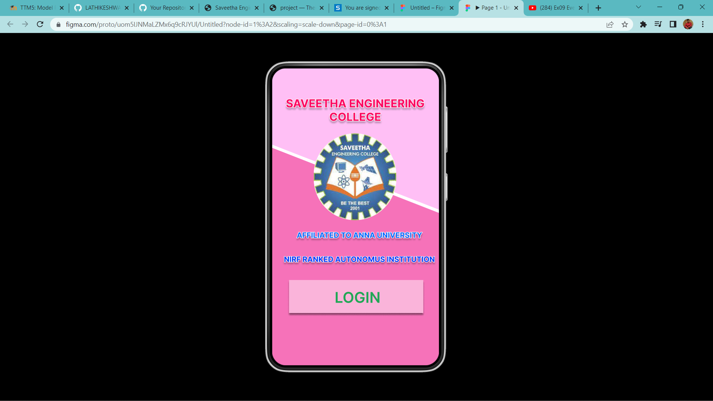
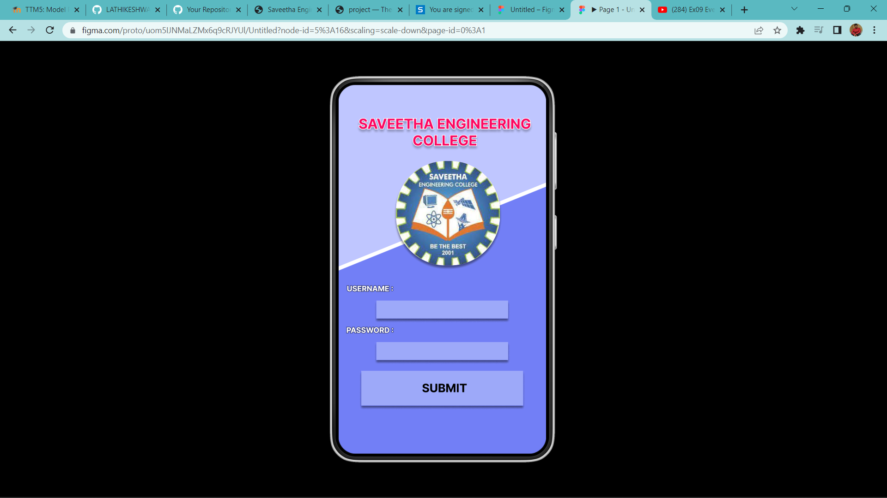
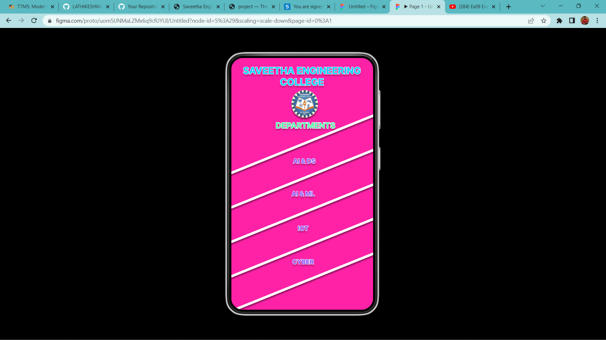

# Event Registration Web Application

## AIM:
To design, develop and deploy a web application for event registration.

## DESIGN STEPS:

### Step 1:
Create a new frame.

### Step 2:
Select any one preset size of your choice.

### Step 3:
Select the shapes you need.

### Step 4:
Import images as needed.

### Step 5:
Create pages based on your need and link them.

### Step 6:

Validate the HTML and CSS code.

### Step 6:

Publish the website in the given URL.

## DESIGN TOOL:
Figma

## CODE:
```
/* Home Page */
position: relative;
width: 360px;
height: 640px;
background: #FFBFF5;


/* Android Small - 1 */
position: relative;
width: 360px;
height: 640px;
background: #BFC6FF;


/* Rectangle 7 */
position: absolute;
width: 903.75px;
height: 6.32px;
left: 497.08px;
top: 94.86px;
background: #FFFFFF;
box-shadow: 0px 4px 4px rgba(0, 0, 0, 0.25), 0px 4px 4px rgba(0, 0, 0, 0.25);
transform: rotate(157.96deg);


/* Rectangle 8 */
position: absolute;
width: 903.75px;
height: 6.32px;
left: 538.08px;
top: 165.86px;
background: #FFFFFF;
box-shadow: 0px 4px 4px rgba(0, 0, 0, 0.25), 0px 4px 4px rgba(0, 0, 0, 0.25);
transform: rotate(157.96deg);


/* Rectangle 9 */
position: absolute;
width: 903.75px;
height: 6.32px;
left: 579.08px;
top: 236.86px;
background: #FFFFFF;
box-shadow: 0px 4px 4px rgba(0, 0, 0, 0.25), 0px 4px 4px rgba(0, 0, 0, 0.25);
transform: rotate(157.96deg);


/* Rectangle 10 */
position: absolute;
width: 903.75px;
height: 6.32px;
left: 620.08px;
top: 307.86px;
background: #FFFFFF;
box-shadow: 0px 4px 4px rgba(0, 0, 0, 0.25), 0px 4px 4px rgba(0, 0, 0, 0.25);
transform: rotate(157.96deg);


/* Rectangle 11 */
position: absolute;
width: 903.75px;
height: 6.32px;
left: 635.08px;
top: 389.86px;
background: #FFFFFF;
box-shadow: 0px 4px 4px rgba(0, 0, 0, 0.25), 0px 4px 4px rgba(0, 0, 0, 0.25);
transform: rotate(157.96deg);


/* SAVEETHA ENGINEERING COLLEGE */
position: absolute;
width: 399px;
height: 186px;
left: -20px;
top: -46px;
font-family: 'Inter';
font-style: normal;
font-weight: 700;
font-size: 24px;
line-height: 29px;
display: flex;
align-items: center;
text-align: center;
color: #00D1FF;
text-shadow: 0px 4px 4px rgba(0, 0, 0, 0.25);


/* DEPARTMENTS */
position: absolute;
width: 329px;
height: 115px;
left: 24px;
top: 114px;
font-family: 'Inter';
font-style: normal;
font-weight: 700;
font-size: 20px;
line-height: 24px;
display: flex;
align-items: center;
text-align: center;
color: #4CF9A6;
text-shadow: 0px 4px 4px rgba(0, 0, 0, 0.25);


/* AI & DS */
position: absolute;
width: 329px;
height: 115px;
left: 21px;
top: 205px;
font-family: 'Inter';
font-style: normal;
font-weight: 700;
font-size: 16px;
line-height: 19px;
display: flex;
align-items: center;
text-align: center;
color: #834CF9;
text-shadow: 0px 4px 4px rgba(0, 0, 0, 0.25);


/* AI & ML */
position: absolute;
width: 329px;
height: 115px;
left: 18px;
top: 288px;
font-family: 'Inter';
font-style: normal;
font-weight: 700;
font-size: 16px;
line-height: 19px;
display: flex;
align-items: center;
text-align: center;
color: #834CF9;
text-shadow: 0px 4px 4px rgba(0, 0, 0, 0.25);


/* IOT */
position: absolute;
width: 329px;
height: 115px;
left: 18px;
top: 376px;
font-family: 'Inter';
font-style: normal;
font-weight: 700;
font-size: 16px;
line-height: 19px;
display: flex;
align-items: center;
text-align: center;
color: #834CF9;
text-shadow: 0px 4px 4px rgba(0, 0, 0, 0.25);


/* CYBER */
position: absolute;
width: 329px;
height: 115px;
left: 18px;
top: 461px;
font-family: 'Inter';
font-style: normal;
font-weight: 700;
font-size: 16px;
line-height: 19px;
display: flex;
align-items: center;
text-align: center;
color: #834CF9;
text-shadow: 0px 4px 4px rgba(0, 0, 0, 0.25);


/* download 2 */
position: absolute;
width: 67px;
height: 70px;
left: 153px;
top: 82px;

background: url(download.jpg);
filter: drop-shadow(0px 4px 4px rgba(0, 0, 0, 0.25)) drop-shadow(0px 4px 4px rgba(0, 0, 0, 0.25));
border-radius: 86px;
```
## OUTPUT:



## RESULT:
The program to design, develop and deploy a web application for event registration is completed successfully.